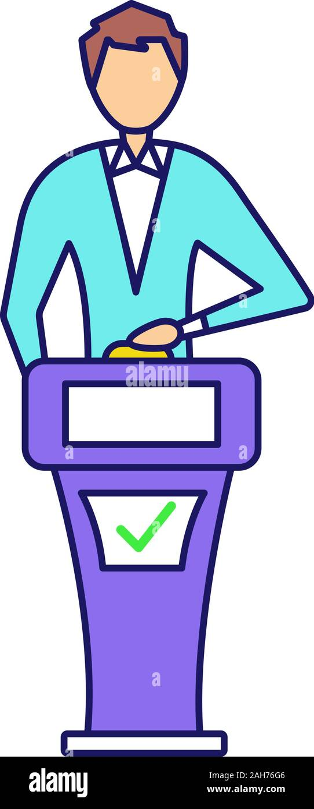

# Quiz-For-Genius

## Purpose
Quiz-For-Genius is an interactive web application designed to challenge users with quizzes across various categories. It aims to provide an engaging platform for learning and testing knowledge in a fun and competitive environment.

## Features
- Multiple quiz categories (e.g., Science, History, IT, etc.)
- Timed quizzes to enhance the challenge
- Score tracking and leaderboard
- Admin panel for managing quizzes and categories
- Responsive design for seamless use on different devices

## Technologies Used
- **Frontend**: HTML, CSS, JavaScript
- **Backend**: ASP.NET Web Forms, C#
- **Database**: SQL Server

## Getting Started
To set up and run Quiz-For-Genius, follow these steps:

### Prerequisites
- .NET Framework (compatible with ASP.NET Web Forms)
- SQL Server for database management
- A web server (e.g., IIS) to host the application

### Installation
1. Clone the repository:
   ```bash
   git clone <repository-url>
   ```
2. Open the solution file `ProjectDesignTemplate.sln` in Visual Studio.
3. Restore NuGet packages:
   ```bash
   nuget restore
   ```
4. Configure the database:
   - Attach the `App_Data/ArUGenius.mdf` database file to your SQL Server.
   - Update the connection string in `Web.config` to match your SQL Server instance.
5. Build the solution in Visual Studio.
6. Deploy the application to your web server.
7. Access the application via your browser.

For detailed instructions, refer to the `INSTALL.md` file.

## Architecture Overview
The project is built using ASP.NET Web Forms and follows a modular structure:

- **Pages**: Contains ASPX files for different functionalities (e.g., quizzes, admin panel).
- **Code-Behind Files**: Each ASPX file has a corresponding `.cs` file for server-side logic.
- **Database**: SQL Server database located in the `App_Data` folder.
- **Static Assets**: CSS, JavaScript, and images are organized under respective folders.

### Key Components
1. **Frontend**:
   - HTML and CSS for layout and styling.
   - JavaScript for interactivity (e.g., countdown timer).
2. **Backend**:
   - ASP.NET Web Forms for server-side rendering.
   - C# for business logic and database interactions.
3. **Database**:
   - Stores quiz data, user scores, and categories.

For more details, refer to the `ARCHITECTURE.md` file.

## Screenshots



## Contribution
Contributions are welcome! Feel free to fork the repository and submit pull requests.

## License
This project is licensed under the MIT License.

## Future Enhancements
- Implementing an API for mobile app integration.
- Adding user authentication and profiles.